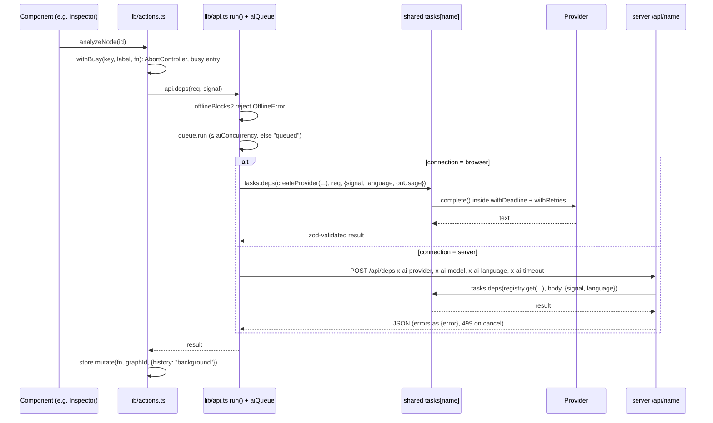

# NodeStorm architecture

A maintainer's guide: what the pieces are, how a click becomes an AI call and a graph change, and where to make the
common changes. Paths are relative to the repository root. For what the app does from a user's point of view, see
the [README](../README.md).

- [1. The big picture](#1-the-big-picture)
- [2. Data model](#2-data-model)
- [3. Persistence](#3-persistence)
- [4. The AI layer](#4-the-ai-layer)
- [5. Client state](#5-client-state)
- [6. Pure graph logic](#6-pure-graph-logic)
- [7. Key flows, end to end](#7-key-flows-end-to-end)
- [8. UI structure](#8-ui-structure)
- [9. Testing and CI](#9-testing-and-ci)
- [10. How to…](#10-how-to)
- [11. Known limitations and follow-ups](#11-known-limitations-and-follow-ups)

## 1. The big picture

NodeStorm is an npm-workspaces monorepo with three packages:

| Package | What it is | Entry points |
|---|---|---|
| `shared/` (`@nodestorm/shared`) | The zod data model and the whole AI core: providers, prompts, tasks, JSON extraction, retries. Runs unchanged in the browser and in Node. No build step: `main` points at `shared/src/index.ts`. | `shared/src/model.ts`, `shared/src/ai/index.ts` |
| `server/` | Optional Express 5 API that runs the same tasks with keys from `server/.env`. | `server/src/index.ts`, `server/src/app.ts` |
| `client/` | Vite 7 + React 19 + `@xyflow/react` v12 (React Flow) + zustand. The real application. | `client/src/main.tsx`, `client/src/App.tsx` |

The client is a static site. In **browser mode** (the default) it imports the providers from `shared/` and calls the
AI provider directly with a key the user typed in; no NodeStorm server exists at all. In **server mode** it POSTs to
`/api/<task>` on the local server (Vite proxies `/api` to port 8787, see `client/vite.config.ts`), which runs the
same task code with keys from its environment.

Layering inside the client, from the bottom up:

1. **Pure logic** in `client/src/lib/*.ts` (graphOps, paths, layout, view, extract, quiz, snapshots, share, export,
   importRepair, projects…): functions from data to data, no React, no store. Most unit tests live here.
2. **Stores** in `client/src/store/*.ts` (zustand): `graphStore` holds all graphs and projects and applies pure
   operations through `mutate`; the others hold settings, view filters, snapshots, quiz and onboarding UI state.
3. **Actions** in `client/src/lib/actions.ts`: async flows that combine AI calls (`client/src/lib/api.ts`) with graph
   mutations and busy/cancel bookkeeping.
4. **Components** in `client/src/panels/` and `client/src/graph/`: read stores, call actions.

## 2. Data model

Everything is defined with zod in `shared/src/model.ts`; the TypeScript types are `z.infer`s of the schemas.

```mermaid
classDiagram
  class GraphExport {
    format: "nodestorm/v1"
    project?: name
    graphs: Graph[]  main first
  }
  class Graph {
    id, name
    nodes: ConceptNode[]
    relations: Relation[]
    parentId?  (sandbox)
    forkedAt?
  }
  class ConceptNode {
    id, name, definition, aliases[]
    status: ok|blocked|checking|unclear|error
    position {x,y}
    dependsOn: node ids
    missingDeps: MissingDep[]
    error?, senses?: Sense[]
    kind?: definition|theorem|lemma|…
    explanation?, anatomy?, notes?, mastery?
  }
  class Relation {
    id, a, b
    aToB: DirRel
    bToA: DirRel
    origin: mix|dependency|derive|extract
  }
  class DirRel { kind, explanation }
  class MissingDep { name, reason, role: uses|derives|assumes }
  GraphExport --> Graph
  Graph --> ConceptNode
  Graph --> Relation
  Relation --> DirRel : two directions
  ConceptNode --> MissingDep
```

- **ConceptNode.** `name`, `definition`, `aliases` (a rename keeps the old name as an alias). `dependsOn` holds the ids
  of prerequisites that are in the graph; `missingDeps` holds prerequisites the AI named that aren't (each with a
  `role`: `uses`, `derives` or `assumes`, and a `reason`). Optional personal data: `explanation` (the latest
  "Explain more" answer with its level, its narrator `voice` if not plain, and time), `anatomy` (the latest "Theorem anatomy", `NodeAnatomy`), `notes`
  (free text) and `mastery` (quiz score, review count, last review time). Stored lookups: `formal` (Mathlib
  declarations) and `papers` (OpenAlex works).
- **Concept kind** (`ConceptKind`, optional `kind`): `definition`, `theorem`, `lemma`, `proposition`, `corollary`,
  `axiom`, `conjecture`, `example`, `notation`, `other`. Graph content (unlike the personal data above, it travels in
  share links). `THEOREM_KINDS` / `isTheoremLike` say which kinds get Theorem anatomy. In AI answers the kind is an
  `AiConceptKind`: case-insensitive, and anything unknown or missing parses as `null` instead of failing the answer,
  so answers from before kinds existed (or from models that invent "remark") still parse. An AI kind is only ever a
  suggestion: `graphOps.suggestKind` sets it while the node has none, so a kind picked in the inspector (`setKind`,
  an undo step) is never overridden. A picked meaning (`applySense`) replaces the kind, since that is a user choice.
- **Status** (`NodeStatus`):
  - `checking`: an AI call for this node is running. It never survives a reload (`onRehydrateStorage` in
    `client/src/store/graphStore.ts` turns it into `error`) or an undo with no task running (`travel` in the same file).
  - `blocked`: it has `missingDeps`.
  - `ok`: checked, nothing missing.
  - `unclear`: the name is ambiguous. `senses` holds the candidate meanings until the user picks one.
  - `error`: the check failed or was cancelled; `error` holds the message and the badge is a Retry button.
- **Relation.** Undirected pair `a`/`b` with **two directions**: `aToB` is what `a` does to `b` and `bToA` what `b`
  does to `a`. Each is a `DirRel` (`kind`, a short phrase or `"none"`, plus an `explanation`). The canvas draws one
  line with an arrowhead at each end; the arrowhead at `b` opens `aToB`. `graphOps.upsertRelation` keeps this
  invariant when a relation is re-created in the other orientation (it swaps the directions).
- **Relation origin** (`RelationOrigin`): where it came from. `mix` (Mix, and the default for old data),
  `dependency` (created by `graphOps.link` when a prerequisite is linked; drawn dashed), `derive` (Derive proposal)
  and `extract` (Extract from text). `upsertRelation` never downgrades a richer origin to `dependency`.
- **Graph.** A main graph, or a **sandbox** when `parentId` is set (the graph it was forked from, possibly another
  sandbox). Node and relation ids are preserved by `fork` so `merge` can match them.
- **Project** (`client/src/lib/projects.ts`, client-only, not in the zod model): `{ id, name, mainId, createdAt }`.
  All graphs of all projects live in one flat `graphs` map; a graph belongs to the project whose main graph it
  descends from through `parentId` (`rootOf`). A flat map means AI results can keep addressing a graph by id no matter
  which project is showing.
- **Share-viewer graph.** A graph opened from a share link (or a previewed version) is put into `graphs` under a fresh
  id and recorded in `graphStore.view`. It is never persisted, exported as part of a project or mutated (`mutate`
  ignores it). See [Share link](#share-link).
- **File format.** `GraphExport` (`format: "nodestorm/v1"`) is the one on-disk format: JSON export, share links and
  version snapshots all use it, and all are read back through `client/src/lib/importRepair.ts`.
- **AI task I/O.** `NameRequest/Response`, `ClarifyRequest/Response`, `RelateRequest/Response`,
  `DepsRequest/Response`, `DeriveRequest/Response`, `ExplainRequest/Response`, `ExtractRequest/Response`,
  `QuizRequest/Response`, `AbsurdChainRequest/Response` (with `AbsurdStyle` and `AbsurdHop`), `AnatomyRequest/Response`,
  `RefereeRequest/Response` (and the other Derive together, Mathlib and cycle tasks). `ExplainRequest.voice` is an
  `ExplainVoice` (default `plain`). Requests carry `NodeBrief`s (`name`, `definition`, `aliases`),
  built with `toBrief`; `name`, `clarify`, `deps`, `derive` and `extract` answers carry a `kind` (`deps`: of the
  analysed concept).
- **Name matching.** `normalizeName` (lowercase, strip Latin accents and punctuation, keep letters of every script,
  crude plural folding for Latin words) and
  `findByName` (name or alias) decide when two concepts are "the same" everywhere: dedupe on add, linking
  prerequisites, install, extract and merge.

## 3. Persistence

Everything is in the user's browser. No account, no backend storage.

| Where | Key | What | Code |
|---|---|---|---|
| localStorage | `nodestorm` | Projects and graphs (zustand `persist`, version 2; v1 held a single brainstorm and is migrated by `migrateWorkspace`). Only the workspace is persisted (`partialize`), never UI state, undo history or a shared graph. | `client/src/store/graphStore.ts`, `client/src/lib/projects.ts` |
| localStorage + sessionStorage | `nodestorm-settings` | Settings. **Split storage**: without *Remember keys* the copy in localStorage has every `apiKey` removed and the full copy (with keys) goes to sessionStorage, so keys vanish with the tab. With it, everything goes to localStorage. Reads prefer sessionStorage. | `client/src/store/settingsStore.ts` (`splitStorage`) |
| localStorage | `nodestorm-view` | View filters (relation origins shown, concept kinds shown, edge labels, to-do only, focus radius). Focus itself isn't stored. | `client/src/store/viewStore.ts`, `sanitizeView` in `client/src/lib/view.ts` |
| localStorage | `nodestorm-ui-language` | Interface language (absent = follow the browser). | `client/src/i18n/index.ts` |
| localStorage | `nodestorm-theme` | Theme preference (absent = auto). | `client/src/lib/theme.ts` |
| localStorage | `nodestorm-onboarding` | Welcome card / tour dismissed. | `client/src/lib/onboarding.ts` |
| localStorage | `nodestorm-chain-game` | "Guess the chain" best scores, `{score, max}` per ordered pair of ends (`pairKey`), at most 200 pairs. | `client/src/lib/chainGame.ts` |
| IndexedDB | database `nodestorm-snapshots`, stores `meta` and `data` | Version snapshots: metadata for the list, and the JSON only loaded to compare or restore. | `client/src/lib/snapshotDb.ts` |
| IndexedDB | database `nodestorm-docs`, stores `docs`, `pages` (key `[docId, page]`) and `sessions` | Derive together: imported documents (metadata plus problems found), their page text, and derivation sessions, per project. Deleted with the project. | `client/src/lib/docDb.ts` |
| memory | — | Undo/redo stacks (per graph, max 100), busy tasks, token usage. | `client/src/lib/history.ts`, `client/src/store/usageStore.ts` |

Every storage access is wrapped in try/catch: a private window with blocked storage still runs, it just forgets.
Snapshots turn themselves off (`useSnapshots.available === false`) when IndexedDB can't be opened.

**Snapshots** (`client/src/lib/snapshots.ts` pure, `client/src/store/snapshotStore.ts` wiring): a snapshot is a
project captured as a `nodestorm/v1` document (`capture`), with an FNV-1a hash so an automatic snapshot of an
unchanged project is skipped. `autoSnapshot(reason)` is called before bulk changes (`installAll`, `extract`, `merge`,
`discard`, `tidy`, `restore`); `startAutoSnapshots` (from `client/src/main.tsx`) marks projects dirty on change and
`periodicTick` takes one every 10 minutes while editing. `planPrune` keeps the last 20 automatic snapshots per
project, all named ones, and evicts old automatic ones past ~20 MB. Writes are serialised (`serial`) so pruning
never races a write.

## 4. The AI layer

### Providers (`shared/src/ai/`)

- `shared/src/ai/provider.ts`: the `Provider` interface (`complete(messages, opts)` and `listModels()`),
  `ProviderError` (with an HTTP-ish `status` and an optional `retry` marker), `CancelledError`, and two helpers every
  provider uses:
  - **`withDeadline(label, {signal, timeoutMs}, fn)`**: runs `fn` with an AbortSignal that fires when the caller
    cancels or the deadline passes, and guarantees the promise settles by then even if `fn` ignores the signal. Aborts
    become `CancelledError` (user) or a 504 `ProviderError` (timeout). Nothing can hang.
  - **`withRetries(label, signal, deadlineAt, attempt)`**: retries `ProviderError`s marked `retry` (429, 408, 5xx,
    529, network failures) up to twice with exponential backoff and jitter, honouring `Retry-After`, and never
    waiting past the deadline. Default timeout is 90 s (`DEFAULT_TIMEOUT_MS`), 15 s for model discovery.
- `shared/src/ai/factory.ts`: `PROVIDERS` (the preset list: label, default model, base URL, whether a key is needed,
  key page, `local`) and `createProvider(kind, cfg)`. SiliconFlow, DeepSeek, Moonshot, Zhipu, DashScope, Ollama and
  "OpenAI-compatible" are all presets of one client.
- `shared/src/ai/openaiCompatible.ts`: `OpenAICompatibleProvider` for any `/chat/completions` endpoint. Asks for
  `response_format: json_object`, and if a model rejects that (an HTTP 400 naming `response_format`) retries without
  it and remembers the endpoint+model in `noJsonMode`. `listModels` hides non-chat models.
- `shared/src/ai/anthropic.ts`: `AnthropicProvider`. The `@anthropic-ai/sdk` is **imported lazily** (`loadSdk`), so
  in the browser it's a separate chunk that only loads when someone talks to Claude; a failed load is retried next
  time. SDK retries are off (`maxRetries: 0`) so `withRetries` owns them. Optional server-side web search for the
  `name`, `clarify` and `relate` tasks; `pause_turn` is resumed up to 4 times.
- `shared/src/ai/mock.ts`: `MockProvider`, the **Offline demo**. A tiny abstract-algebra knowledge base; it
  identifies the task from the `[task:<name>]` marker in the system prompt and parses the `INPUT:` JSON of the user
  message. Deterministic, so unit and e2e tests use it.

### Tasks, prompts, schemas

- `shared/src/ai/prompts.ts`: one `<task>Prompt(req)` per task returning `ChatMessage[]`. `sys(kind, …)` adds the
  `[task:kind]` marker; `withLanguage` appends the output-language paragraph (`languageInstruction`) to the system
  message when the user picked an answer language (`"auto"` means "match the input").
- `shared/src/ai/tasks.ts`: the `tasks` object, one entry per task:
  `name`, `clarify`, `relate`, `deps`, `derive`, `explain`, `anatomy`, `extract`, `quiz`, `resolveCycle`, `absurdChain`,
  `mathlib`, and for Derive together `readPage`, `splitProblems`, `tutorHint`, `checkStep` and `refereeReport`. Each parses the request with its zod
  schema, builds the prompt and calls `runStructured`, which:
  1. calls `provider.complete(messages, { json: true, … })`,
  2. pulls the JSON object out of the reply with **`extractJson`** (tolerates code fences, prose, and a leading
     `<think>…</think>` block from reasoning models; tries each `{` until one parses),
  3. validates it with the response schema and the task's optional `check` function, and on a malformed answer
     (either one throws) asks once more, quoting the error.
  Timeouts and cancellation are not retried there. Some tasks post-process: `clarify` treats "ambiguous with one
  sense" as unambiguous, `extract` runs `cleanExtraction` (dedupe, cap 40 concepts, drop relations with unknown
  ends), `quiz` runs `cleanQuiz` (a multiple-choice set only if it's four distinct options with a valid index),
  `anatomy` runs `cleanAnatomy` (trimmed, no empty hypotheses, at most 8 hypotheses and 3 examples / non-examples).

**Concept kinds in prompts.** `KIND_GUIDE` / `KIND_VALUES` in `prompts.ts` describe the kinds; the `name`, `clarify`,
`deps`, `derive` and `extract` prompts ask for one, and `languageInstruction` keeps the kind values in English.

**Theorem anatomy** (`anatomyPrompt`): given the statement (with its kind) and its prerequisites, the model lists the
hypotheses (with what each is for and a counterexample without it), the conclusion, a 2-4 sentence proof idea
(evidence for a conjecture, never a full proof), examples and non-examples. The mock answers it for its two KB
theorems (First Isomorphism Theorem, Lagrange's theorem) and builds a fallback from an "If …, then …" definition.

`TaskName = keyof typeof tasks` is used by both the server and the client, so adding a task to this object is what
makes it exist everywhere.

**Absurd chain** (parody mode). `absurdChain` gets two `NodeBrief` ends, a `style` (`deadpan`, `conspiracy`, `epic`,
`bureaucratic`, `academic-overkill`), a hop range (1-7, default 3-5), the graph's concepts as context and an `avoid`
list (intermediate concepts of earlier rolls, so "Roll again" takes another route). The dialog's **Surprise me** fills
both ends with `surprisePair` and builds at once. The answer is a `title`, a
`chain` of hops `{from, to, kind, fact, quip}`, a `moral` and a sober `plausibility` note. The prompt insists that
every `fact` is true, standard knowledge and that the comedy stays in `quip`, `title` and `moral`, and that nothing is
unkind. `cleanAbsurdChain` (its `check`) gives the ends the requested names (matching by name or alias), cuts the
chain where it first reaches the goal, cuts out loops, and throws a `ProviderError` for a chain that starts
elsewhere, has a gap between hops, never arrives or has more than 10 links; a broken chain is therefore asked for once
more before the error reaches the user. The mock answers from `BRIDGES` in `mock.ts`: true facts linking its algebra
KB to *Fourier transform*, *Heat equation*, *Maillard reaction*, *Toast* and a few more (shortest route by BFS, avoiding
`avoid` when it can), an unknown end joining through *Written language*, and per-style templates for the narration.

**Explain voices** (parody narrators). `ExplainVoice` is `plain` (the default) or `nature-documentary`,
`sports-commentator`, `noir-detective`, `medieval-scholar`, `infomercial`, `shakespearean`. `voiceInstruction`
(`prompts.ts`, one line per voice in `VOICE_GUIDE`) adds a paragraph to the `explain` prompt, in the same spirit as
the Absurd chain: the voice changes only the telling; every statement stays exactly as correct, precise and at the
chosen level as a plain answer, formulas stay `$…$`, and `summary` stays a sober definition (it can become the
concept's definition). `plain` adds nothing, so plain prompts are unchanged. The answer schema is the same;
`explainNode(id, level, graphId, voice)` stores `voice` on `NodeExplanation` (optional, so old data parses; omitted
for plain), and import repair resets an unknown voice to plain instead of dropping the explanation. The mock wraps its
plain answer in fixed per-voice phrases (`EXPLAIN_VOICE` / `voiced` in `mock.ts`), so the content is identical.

**Images.** `ChatMessage.content` is a string or `ContentPart[]` (text and base64 images; `textOf` reads the text).
Only `readPage` sends an image: `openaiCompatible.ts` turns it into an `image_url` data URL and `anthropic.ts` into an
`image` block. The client sends `readPage` to the provider's vision model (`visionModel(kind)` in
`client/src/lib/api.ts`: the Settings value, else `ProviderMeta.visionModel`, else the chat model). The server accepts
10 MB bodies on `/api/readPage` only; every other route keeps 1 MB.

**Tutor tasks.** `tutorHint` and `checkStep` get the problem, the earlier steps, up to 8 numbered reference passages
and the graph's concepts. The shared system text (`TUTOR` in `prompts.ts`) forbids writing the next step or the
answer. Hints get stronger with `nth`. Post-processing drops citation numbers that weren't given (`validCites`),
dedupes concepts, and counts `solved` only for an `ok` step. `splitProblems` runs `cleanProblems` (dedupe; pages
outside the sheet become null).

**Reviewer 2** (`refereeReport`). Gets the tutor input plus the earlier step checks (`checks`: step number, verdict,
comment, solved) and answers with a `verdict` (`accept`, `minor revisions`, `major revisions`, `reject`, parsed
case- and separator-insensitively), a funny `summary`, `points` (`step?`, `severity` `fatal|major|minor|pedantic`
(unknown ones become `minor`), `comment`) and `grudgingPraise`. The prompt keeps the Absurd chain's split: the
technical points must be real (never an invented error in a correct step), the comedy is only in the tone, nothing
unkind; and it shares `NO_SOLUTION` with `TUTOR`, so it never writes the fix, the next step or the answer.
`cleanReferee` drops step numbers that don't exist, dedupes, sorts by severity, keeps 8 points, and never accepts a
derivation with no steps. The mock derives the report from each step's earlier check, or from its own `checkStep`
heuristic when there is none (error → fatal, gap → major, unclear → minor, correct → a pedantic remark; unfinished
→ major revisions).

### Encyclopedia lookups (`shared/src/lookup/`, `client/src/lib/lookup.ts`)

These are plain `fetch` calls to public APIs, not an AI task. They work the same in the browser and in Node, and `fetch` is injectable for tests.
- `lookupConcept({name, lang, sites, max})` tries the sites in order and returns the first answer, as `LookupSense[]` (name, domain, definition, aliases, `source`). It also returns `blocked`: the sites that refused.
- **`proofwiki.ts` part of `sites.ts`**:
  - Reads `Definition:<Title Case Name>` through `api.php?action=parse&prop=wikitext`.
  - Follows one `{{:…}}` transclusion.
  - On a disambiguation page, or when there is no page, takes the listed definitions or a `prefixsearch`.
  - `wikitext.ts` turns the Definition section into prose: links become their text, templates, refs and categories are dropped, and ProofWiki's macros (`\map`, `\set`, `\paren`, `\closedint`, …) are expanded into standard LaTeX by `expandMacros`.
- **Wikipedia**:
  - `action=query&prop=extracts|description|pageprops|info` with `explaintext`.
  - Its plain text writes each formula as a MathML dump plus `{\displaystyle …}`; `mathFromExtract` keeps the LaTeX as `$…$` and drops the dump.
  - A missing or disambiguation page falls back to Wikidata `wbsearchentities`, one sense per item. `wbgetentities` gets each item's article; all the intros come back in one more query.
- **`http.ts`**:
  - Every request sends `Api-User-Agent`, as Wikimedia's rules ask.
  - A Cloudflare challenge (`cf-mitigated`, a non-JSON answer, or a CORS or network failure) or a 429 is a `SiteBlockedError`; a 404 is "nothing there".
- **Client (`lib/lookup.ts`)**:
  - Settings: `lookup.enabled/proofwiki/wikipedia`.
  - `lookupLanguage` goes from the answer language, or the name's script, to a Wikipedia code.
  - A localStorage cache holds 500 names for 30 days; only clean answers are cached.
  - A site that refused is paused for 10 minutes, and Settings shows that.
- **In `analyzeNode`**: a concept without a definition is looked up first.
  - One sense gives the definition and `source` (plus the looked-up title as an alias).
  - Several senses go to `SenseDialog` (`Sense.source` shows "from Wikipedia").
  - Nothing found falls through to the AI `clarify`.
  - With no AI ready, a looked-up concept is left `ok` and a one-time notice appears, instead of opening Settings.
  - `relookup` backs "Look up again" (one undo step).
- **Tests never touch the real sites**:
  - `test-setup.ts` makes those hosts fail in vitest.
  - The e2e routes abort them, except the "Definitions from encyclopedias" section, which serves fixtures.

### Lean / Mathlib (`shared/src/lookup/loogle.ts`, `findInMathlib` in `actions.ts`)

- **Suggest:** the `mathlib` AI task suggests up to 6 fully qualified Lean 4 names. The task filters them with `isLeanName` and removes duplicates.
- **Verify:** `loogleDeclaration(name)` asks `loogle.lean-lang.org/json?q=<name>`, which allows cross-origin requests (only the `User-Agent` and `X-Loogle-Client` headers, so `getJson` sends Loogle no other). An exact name comes back as the first hit; an unknown one is an error, which gives `null`.
- **Store:** verified declarations (name, type, module, doc, why) and the dropped names go into `node.formal`. It is a background mutation, like an explanation. It is kept in JSON exports and validated by import repair, but left out of share links. The Markdown export lists the names.
- **Show:** the inspector's "Lean / Mathlib" section links each declaration to `mathlib4_docs/<module path>.html#<name>` (`mathlibDocUrl`).
- **Tests:** Loogle is blocked in tests like the encyclopedias; the e2e serves fixtures.

### Papers (`shared/src/lookup/openalex.ts`, `findPapers` in `actions.ts`)

The same pattern with no AI at all: real literature for a concept, where an AI's reading list could invent sources.

- **Search:** `findPapers({name, context, max})` asks `api.openalex.org/works` with
  `filter=title_and_abstract.search:"<name>",is_retracted:false,type:!paratext|erratum|…` (relevance order, which
  counts citations), `per_page` and a `select` of the fields shown. `searchPhrase` keeps letters, digits, spaces,
  hyphens and apostrophes only, lower-cased, since `,` `|` quotes and upper-case AND/OR/NOT are filter syntax.
  - Why not `search=`: it also reads full texts, so "normal subgroup" finds medical studies of a "normal" patient
    "subgroup". OpenAlex calls the `.search` filters legacy but still serves them; if they go, `search=` plus a field
    filter is the fallback.
  - **Disambiguation:** a one-word name ("Kernel") is searched as `"kernel" AND ("group homomorphism" OR …)` with up to
    four prerequisite names (in-graph, then missing); fewer than half of `max` results → a second request with the
    name alone fills the list. Longer names are specific already: requiring a prerequisite in the abstract only traded
    the standard references for obscure ones in live tests, so they are searched alone.
  - `toPaper` maps a work to `PaperWork`: bare DOI, `url` = DOI link, else landing page, else `openalex.org/W…`
    (https only), first three authors plus "et al.", venue, `citedBy`, `openAccessUrl` (https, not a repeat of `url`).
    Markup in titles is stripped.
- **Headers and budget:** OpenAlex's CORS allows only standard headers (Accept, Authorization, Content-Type…), so
  `identify` in `http.ts` gives it none. The polite pool (`mailto=`) was replaced by API keys in February 2026 and
  `mailto` is ignored, so none is sent. Without a key every IP address gets $0.10 of usage a day, and a search costs
  $0.001: about 100 searches per network per day, renewed at midnight UTC. A spent budget is a 429, i.e. a
  `SiteBlockedError("rate limited")`, which the action turns into "the free daily allowance is used up".
- **Store:** `{works, query, checkedAt}` in `node.papers` (`NodePapers` in `model.ts`: at most 25 works, bounded
  strings, `url`/`openAccessUrl` must be https). A background mutation like `formal`; `merge` keeps the newer list;
  import repair drops a malformed one; share links leave it out. Markdown lists the works under **Further reading**;
  the LaTeX export writes a `remark[Further reading]` with `\href`s (`texUrl` escapes `%` and `#` and percent-encodes
  braces, backslashes and spaces).
- **Show:** the inspector's "Papers" section (after Lean / Mathlib; hidden in the share viewer, which never has
  papers): Find papers / Search again with Cancel while running, each title linking out (`target=_blank`,
  `rel=noopener noreferrer`), byline · citations · free copy, the query used and a "Search OpenAlex yourself" link.
- **Tests:** `api.openalex.org` is blocked in vitest and the e2e like the other lookup hosts; `shared/test/papers.test.ts`
  checks the query, parsing and headers with a fake fetch, `client/test/papers.test.ts` the action and exports, and
  the e2e "Papers" section serves fixtures. `npm run smoke:papers` (`scripts/papers-smoke.mts`) queries the real API.

### Browser mode vs server mode



- **Client side** (`client/src/lib/api.ts`): `run(name, req, signal)` is the single entry point. `runNow` reads
  settings at the moment the call actually starts (so a queued call uses the latest ones). Browser mode builds the
  provider with `browserProvider` (throws `NeedsSetupError` when a key is missing; `reportError` in actions then
  opens Settings). Server mode uses `serverFetch` with the headers `x-ai-provider`, `x-ai-model` (the per-provider
  server model override), `x-ai-language` (URI-encoded, since header values must be ASCII) and `x-ai-timeout`; it
  gives the server `2 × timeout + 5 s` because the server may retry once on malformed output.
- **Server side** (`server/src/app.ts`): one `POST /api/<name>` route per key of `tasks`, plus `GET /api/providers`
  and `GET /api/models?provider=`. `parseTimeout` clamps the header to 10 s…600 s. The request's `close` event aborts
  the upstream call. Errors map to status codes: cancel → 499, zod → 400, `ProviderError` → its status, else 500.
  `server/src/providers/registry.ts` builds providers from env vars `<KIND>_API_KEY`, `<KIND>_BASE_URL`,
  `<KIND>_MODEL` (plus `ANTHROPIC_WEB_SEARCH=1` and `AI_PROVIDER` for the default). The client may choose provider
  and model, never the key.
- **Queue** (`client/src/lib/aiQueue.ts`): `createLimiter(limit)` is a FIFO concurrency limiter (default 3, Settings →
  parallel AI calls). A task aborted while waiting is dropped with `CancelledError`. Its `onState` callback marks the
  owning busy task as `queued`/`running` via `graphStore.setBusyState` (matched by AbortSignal), which is how the
  status bar shows "queued".
- **Offline guard** (`client/src/lib/online.ts`): `offlineBlocks(provider, navigator.onLine)` rejects immediately with
  `OfflineError` unless the provider is `local` (Offline demo, Ollama), instead of waiting for a timeout.
- **`withBusy(key, label, fn, handlers)`** (`client/src/lib/actions.ts`): wraps every AI call as a visible,
  cancellable task. It owns one `AbortController` per busy key (a new run with the same key aborts the old one),
  registers `busy[key]` for the status bar, drops answers that arrive after a cancel, and turns errors into a toast
  (or the caller's `onError`). `cancelTask(key)` is what the status bar's cancel (X) button and dialogs' Cancel call. Busy keys
  follow patterns such as `analyze:<graphId>:<nodeId>`, `installAll:<graphId>:<nodeId>`, `mix:<a>:<b>`,
  `explain:<graphId>:<nodeId>`, `anatomy:<graphId>:<nodeId>`, `mathlib:<graphId>:<nodeId>`, `papers:<graphId>:<nodeId>`, `relookup:<graphId>:<nodeId>`,
  `quiz:<graphId>`, `name`, `derive`, `extract`, `absurd`, and Derive together's `derive-hint`, `derive-check`,
  `derive-referee` (`DERIVE_KEYS`).
- **`inViewer(graphId)`**: every AI action first checks whether its graph is the share-viewer graph and refuses (with
  an info toast) if so. Only calls for that graph are refused; work on the user's own graphs continues.
- **Token usage**: browser-mode providers call `onUsage`, which adds to `client/src/store/usageStore.ts` (shown in
  Settings). Server mode doesn't report usage.

## 5. Client state

### `graphStore` (`client/src/store/graphStore.ts`)

Persisted: `graphs`, `projects`, `projectId`, `activeId`. UI-only: `selection`, `inspect` (a node, or one direction of
a relation), `busy`, `toast`/`toastKind`, `settingsOpen`, `clarifying`, `highlight`, `history`, `view`.

**`mutate(fn, graphId?, { history, key })`** is the only way graph content changes. `fn` is a pure
`(Graph) => Graph` (normally from `graphOps`). The history option decides how it shows up in undo:

- `"step"` (default): a new undo step. Consecutive steps with the same `key` are coalesced (typing into one field).
- `"merge"`: folded into the previous step, for follow-up bookkeeping of one user action (e.g. Derive's links after
  its add).
- `"background"`: not an undo step at all. The same `fn` is also applied to every past and future snapshot
  (`hist.rebase`). This is used for **AI progress and results** (status → checking, deps found, explanation, mastery).
  Why: an AI answer arrives seconds later, possibly after the user did other things. If it were a step, undo would
  first take back the AI result instead of the user's own last action; if it were applied only to the present, undo
  would resurrect a stale "checking…" spinner or lose the prerequisites the AI found. Rebasing keeps the AI's findings
  in every state the user can travel to. `fn` must therefore be a no-op where it doesn't apply, which is why
  `analyzeNode` wraps its patches in `sameConcept` (skip snapshots where the node is a different concept, e.g. still
  unclear or renamed).

`mutate` silently ignores unknown graphs (discarded while an AI call was running) and the viewer graph.

Other actions: project CRUD (`newProject`, `switchProject`, `renameProject`, `duplicateProject`, `deleteProject`,
all delegating to `client/src/lib/projects.ts`), `forkActive`/`mergeSandbox`/`discardSandbox`, `exportJson`/
`importJson`, `addProject`/`restoreProject` (Versions), `openView`/`closeView`/`saveViewCopy` (viewer), `loadExample`.
Selectors: `activeGraph`, `isViewing`, `currentProject`, `canUndo`, `canRedo`.

### Other stores

- `client/src/store/settingsStore.ts`: connection (`browser`/`server`), provider, per-provider `configs` (key,
  base URL, model, timeout), `rememberKeys`, `serverModels`, clarify options, install-all limits, answer `language`,
  `aiConcurrency`. `isReady(s)` says whether AI calls can run without opening Settings.
- `client/src/store/viewStore.ts`: view filters (persisted) and focus mode (`focus`, not persisted); `visibleNow`
  and `toggleFocus` helpers used by `App.tsx`.
- `client/src/store/snapshotStore.ts`: snapshot list and the functions described in [Persistence](#3-persistence).
- `client/src/store/quizStore.ts`: which quiz dialog is open (progress itself is `mastery` on the nodes).
- `client/src/store/deriveStore.ts`: Derive together. Panel state (open, tab, reader), the project's documents, pages
  and sessions (loaded from `docDb` per project; reloaded on project switch), and its actions: `importFile` (pdf.js
  text, then scanned pages through `readPage` one at a time), `findProblems` (`splitProblems` in batches of about 11,000
  characters), `hint` / `check` (BM25 retrieval over the reference documents, then the tutor task; a check whose step
  was edited meanwhile is dropped), `referee` (Reviewer 2: the same retrieval, the steps and `checksForReferee`; the
  report is saved on the session as `referee` with the `stepsKey` of the steps it read), and `addToGraph`.
- `client/src/store/absurdStore.ts`: whether the Absurd chain dialog is open and its starting ends (`openAbsurd` takes
  them from the selection: two selected concepts, else the one selected or inspected).
- `client/src/store/onboardingStore.ts`: welcome card and tour state.
- `client/src/store/usageStore.ts`: session token count.
- `client/src/lib/theme.ts` and `client/src/i18n/index.ts` hold small zustand stores of their own (`useTheme`,
  `useLocale`).

## 6. Pure graph logic

All in `client/src/lib/`, no React or store imports (except `t` for messages in a few places), unit-tested in
`client/test/`.

| File | What |
|---|---|
| `graphOps.ts` | Node/relation CRUD: `addNode` (dedupes by name/alias, places at `findFreeSpot`, then `satisfyMissing`), `applyDeps`, `link`, `satisfyMissing` ("installing" = adding a node whose name matches someone's missing dep), `upsertRelation`, `renameNode`, `updateRelation`, `removeNode`, `removeRelation`, `removeDependency`, `applySense`, `redirectNode`, `installPosition`, `setPositions`, `fork`, `merge`. |
| `cycles.ts` | A cycle's links with their stored reasons (`cycleLinks`), `removeLinks`, `remainingCycle`, `fallbackLinkIndex`. |
| `paths.ts` | Over `dependsOn`: `prerequisiteClosure`, `learningPath` (topological study order incl. missing deps), `findCycles` (Tarjan SCC), `cycleInfo`, `cycleThrough`. |
| `layout.ts` | `layeredLayout` for Tidy: rows by dependency depth, prerequisites on top. |
| `view.ts` | `sanitizeView`, `neighbourhood` (focus hops), `visibleParts` (relation origins, concept kinds via `kindFilterOf` / `KIND_FILTERS` with "none" for untyped, to-do, focus), `showsEverything`. |
| `kinds.ts` | Concept kinds: `KINDS`, `KIND_LABEL` (message keys), `KIND_NAME` (English, for exports), `KIND_TONE` (colour family of the `.kind-tag--<tone>` classes). |
| `extract.ts` | Extract-from-text review model: `buildReview`, `duplicateOf`, `resolveEndpoint`, `linkUsable`, `applyExtraction`. |
| `derivation.ts` | Derive together sessions: `addStep`/`editStep`/`removeStep` (edits drop the checks after them), `setCheck`, `addHint`, `nextHintNumber`, `isSolved`, `numberReferences` (passages → `[n]` and back to doc/page), `sessionConcepts`, `buildGraphPlan` / `applyGraphPlan` (reuses `applyExtraction`, then sets `source` and notes), `toMarkdown`; Reviewer 2: `stepsKey` (a hash of the steps' text), `checksForReferee`, `setReferee`, `refereeOutdated` (the card says so; the Markdown copy leaves an outdated report out). |
| `absurd.ts` | Absurd chain: `chainConcepts`, `intermediates`, `chainToText` (clipboard), `sandboxName`, `hopExplanation`, `surprisePair` ("Surprise me": two different random concepts of the graph, else its one concept and
`FUN_ENDS`; avoids the pair on screen), and `applyAbsurdChain` (reuses concepts by name or alias, places new ones between the ends or in a staircase, adds one relation per hop: `aToB` = kind plus fact and quoted narration, `bToA` = `none`, origin `mix`; never overwrites an existing relation; new concepts get a note naming the chain). |
| `chainGame.ts` | "Guess the chain": `newGame` (the intermediate concepts become stops, with aliases from the graph), per stop `hidden` → `clued` → `guessed`, or `revealed`; `guess` (checks every open stop, any order; `known` for an end or a found concept, else counts a wrong guess), `clue`, `reveal`, `revealAll`, `score` / `maxScore` / `tally` (`POINTS`: 3 alone, 2 after a clue, 0 revealed); `matchesName` (`normalizeName`, leading article, aliases, `editDistance` with transpositions within `typoAllowance`: 0 up to 4 characters, 1 up to 8, else 2); `mask` blanks hidden names as whole words (longest name first, so a shown "Heat equation" keeps its "Heat"); `linkView` (fact and narration once both ends are known, else the masked narration as a clue); best scores `bestFor` / `recordBest` (storage injectable, errors ignored). |
| `retrieve.ts` | `chunkPages` (~900-character chunks within a page, with overlap), `tokenize` (Latin words minus stopwords, LaTeX commands, CJK bigrams), BM25 `buildIndex` / `search`. |
| `pdf.ts` / `docDb.ts` | pdf.js (legacy build, lazily loaded with its worker) text per page, `looksScanned` (no text, or little text plus a picture), `renderPageImage` (JPEG, longest side ≤ 1600px) / IndexedDB wrapper for documents, pages and sessions. |
| `texImport.ts` | LaTeX import, no AI. `theoremEnvs` reads the `\newtheorem` declarations. `parseTexResults` finds each theorem-like environment with its kind, title, labels and refs (statement plus the following proof), and the terms a definition defines. `texToText` turns prose into text: maths is kept, display maths becomes `$$…$$`, and refs become names. `texReview` builds an `ExtractReview` (unique names, `\ref` links, optional unticked mention links) for `ExtractDialog`'s `initial` prop. |
| `quiz.ts` | Spaced-repetition-lite: `updateMastery`, `strength`, `masteryLevel`, `studyOrder`, `quizPlan`, `nextConcept`, `pickStyle`, `summarize`. |
| `snapshots.ts` / `snapshotDb.ts` | Version capture, hash, prune plan, diff, `keepMastery` / IndexedDB wrapper. |
| `importRepair.ts` | `repairImport(raw)`: accepts anything graph-like, fills defaults, drops dangling references, resets unknown enum values, and returns human-readable `fixes`. |
| `share.ts` | `packGraph`, `encodeShare`/`decodeShare` (deflate + base64url in the URL hash), size limits. |
| `export.ts` | `toMarkdown` (with kinds, explanations and anatomies), `toMermaid`, `exportFileName` (and its own `studyOrder`). PNG export is in `Toolbar.tsx`. |
| `latex.ts` | `toLatex`: an amsart document, one amsthm environment per kind (`ENV`; untyped and "other" are `concept`), in `studyOrder`, with `labels` (unique `c:<slug>`) and "Uses: Definition~\ref{…}" lines; `texEscape` escapes the text between formulas (`splitMath`) and maps common Unicode symbols; notes become remarks and an anatomy proof idea a `proof`. |
| `glossary.ts` | `buildGlossary` / `pickSymbol`: the notation glossary (definitions and notation concepts; LHS of a defining equation, else the first short non-variable formula). |
| `flashcards.ts` | `buildCards` (definition / prerequisite / relation cards in study order, or one learning path), `toAnki` (tab-separated with Anki's `#` header lines, HTML-escaped, `$…$` → `\(…\)` via `splitMath`), `toCsv` (RFC 4180). Used by `FlashcardsDialog`. |
| `math.ts` | `splitMath`/`hasMath`: the LaTeX delimiter parser behind `MathText`, the Markdown export and `ankiMath` (see *Math* in section 8). |
| `projects.ts` | Workspace operations, `cloneGraphs` (fresh ids with one shared map), `normalizeWorkspace`, `migrateWorkspace`. |
| `history.ts` | `record`, `undo`, `redo`, `rebase`. |
| `fuzzy.ts`, `examples.ts`, `shortcuts.ts`, `onboarding.ts` | Find (`searchNodes`), the offline Group theory example (`client/src/data/groupTheory.json`), the shortcut list for the `?` dialog, tour logic. |
| `viewport.ts` | Bridge from actions to the canvas (`viewport.center/reveal/focus/fit`); a no-op without a canvas (unit tests). |

## 7. Key flows, end to end

### Add concept → clarify → deps → install / install all

1. `AddNodeDialog` calls `addConcept({ name, definition })` (or `suggestNames(description)` → `api.name` →
   `addCandidate`).
2. `addConcept` (`client/src/lib/actions.ts`) positions at the viewport centre, `mutate(ops.addNode)` as an undo step
   (status `checking`; `satisfyMissing` links it into anyone who was missing it), reveals it, then calls
   `analyzeNode(id, graphId)`.
3. `analyzeNode`: if the node has no definition and clarifying is on, `api.clarify`. Ambiguous → background
   `status: "unclear", senses`, and `setClarifying` opens `SenseDialog`; the user's choice goes to `chooseSense` →
   `ops.applySense` (may merge into an existing concept) → `analyzeNode` again. Unambiguous → store the definition.
4. `api.deps` with the other concepts as context → background `ops.applyDeps`: prerequisites that match an existing
   concept (`matchesExisting` or by name) are `link`ed (`dependsOn` + a `dependency` relation); the rest become
   `missingDeps` and the node is `blocked`. If `paths.cycleThrough` finds a cycle, `resolveCycle` (actions.ts) asks the
   `resolveCycle` AI task which link is wrong (links and their reasons from `client/src/lib/cycles.ts`), falls back to
   the link the check just added, and removes it as one undo step (setting `autoResolveCycles`; otherwise a warning).
5. **Install** (Inspector) → `installDep(dependentId, name)` → `placeDep` adds the concept at `installPosition` with a
   hint ("Needed by X (role): reason") so its clarify rarely needs the user → `analyzeNode` on it.
6. **Install all** → `installAllMissing(rootId)`: `autoSnapshot("installAll")`, then breadth-first over levels: place
   every missing dep of the frontier (`placeDep`), analyze siblings in parallel with `{ quiet: true }` (no dialogs,
   through the AI queue), next frontier = the ones that became ok/blocked. Stops at `installAll.maxDepth` /
   `maxNodes`. One `withBusy` covers the run; cancelling it cancels the in-flight checks. Ends with an
   `installSummary` toast (unclear, failed, left over, cycles).

### Mix

Toolbar Mix (two selected, neither blocked/unclear) → `mix(aId, bId)` → `api.relate` → `mutate(upsertRelation(…,
"mix"))` as a normal undo step (the user asked for it) → the inspector opens the `a → b` direction.

### Derive

`DeriveDialog` → `derive(selectedIds, goal)` → `api.derive` returns proposals; each **Accept** →
`acceptProposal(p, anchorIds)` → `addConcept` below the anchors, then one `mutate` adding a `derive` relation per
link, as `"merge"` into the add's undo step.

### Extract from text

`ExtractDialog` → `extractFromText(text, focus)` → `api.extract` (server-side `cleanExtraction`) → `buildReview` (dup
detection, ticks) → user edits the review → `insertExtraction(review)`: `autoSnapshot("extract")`, one
`mutate(applyExtraction(…, viewport.center()))` (one undo step; new concepts laid out in layers; relations with
origin `extract`, never overwriting a user relation), then quiet `analyzeNode` for every new concept through the queue.

### Derive together

The panel (`client/src/panels/derive/`, lazily loaded, mounted by `DeriveHost` inside `.main` next to the canvas; not
a modal, so the graph stays usable) has a Library (import, problem sheets, your own problem, sessions), a Workspace
(problem, steps with verdicts, hints, which references to cite) and a Reader (page text; selecting text starts a
derivation from it; unreadable scanned pages can have text pasted in).

1. Import: `readPdf` → pages; scanned pages → `renderPageImage` → `api.readPage` (vision model) → `putDoc`. For a
   sheet, `findProblems` runs straight away.
2. Hint / Check: `references()` builds (or reuses) a BM25 index over the chosen reference documents. The query is the
   problem, the last two steps and the step being checked; the top 6 chunks go in, numbered. `api.tutorHint` /
   `api.checkStep` answer with `[n]` citations, which `numberReferences().resolve` maps back to document and page.
3. Add to graph: `AddToGraphDialog` edits a `GraphPlan` (`buildGraphPlan`), then `addToGraph` →
   `autoSnapshot("deriveTogether")` → one `mutate(applyGraphPlan)` (one undo step) → quiet `analyzeNode` on new
   concepts → the result is highlighted and revealed.

A node's optional `source` (`{title, page}`, `SourceRef` in `model.ts`) travels in JSON exports, share links (it
is graph content, not personal), import repair and the Markdown export.

### Absurd chain

Toolbar (theatre-masks button next to Mix) or File → Absurd chain… → `useAbsurd.openAbsurd()` → `AbsurdChainDialog`
(lazy, mounted by `App.tsx`; ends prefilled from the selection, editable, with the graph's names as suggestions) →
`absurdChain(from, to, style, hops, avoid)` in actions.ts: an end that names a concept of the graph goes with its
definition, anything else as typed; `withBusy("absurd", …)`, cancelled when the dialog closes. Nothing touches the
graph until **Add to a sandbox** → `addAbsurdChainToSandbox(res)`: `forkActive(sandboxName(title))` (switches to the
new sandbox), one `mutate(applyAbsurdChain)` there (one undo step), then quiet `analyzeNode` for each new concept with
the hop's fact as the clarify hint. The user's graph only changes through **Merge back**.

**Guess the chain** (the dialog's second build button) runs the same `absurdChain` call (same avoid list, so *Play
again* takes another route) and shows `ChainGame` (`client/src/panels/ChainGame.tsx`, same chunk) instead of the
chain, remounted with a new `key` for each round. The board keeps its own `ChainGame` state from
`client/src/lib/chainGame.ts`; the guess field and the feedback line (`role="status"`) sit above the timeline, each
open stop's Clue and Reveal buttons sit on the link that arrives at it, and focus returns to the guess field after
every move and goes to the summary when the game ends (which records the best score). Copy and Add to a sandbox are
hidden until then, since they would give the chain away.

### Fork / merge

`forkActive(name?)` → `ops.fork` (deep copy, same node/relation ids, `parentId`, `forkedAt`) and switch to it. Sandbox banner
(`SandboxBanner` in `client/src/App.tsx`): **Merge back** → `autoSnapshot("merge")` + `mergeSandbox` → `ops.merge`
(sandbox wins on shared ids, parent-only content kept, independently-added same-name concepts folded), recorded as one
undo step in the parent; child sandboxes are re-parented. **Discard** → `autoSnapshot("discard")` + `discardSandbox`.

### Share link

`ShareDialog` → `encodeShare(graph, name)`: `packGraph` (short ids, drops empty fields, settles `checking`/`error`,
**leaves out notes, explanations, anatomies, mastery and stored lookups (Mathlib, papers)**; keeps kinds) → JSON → raw deflate (`CompressionStream`, or `fflate` loaded on
demand) → base64url → `#share=1.<data>`. The hash never reaches a server. Opening: `openShareLink` in
`client/src/App.tsx` (on load and on `hashchange`) → `decodeShare` (length caps, inflate with a 5 MB bomb guard,
`repairImport`) → `graphStore.openView(graph, name)` (fresh id, `view` set, read-only). `ViewerBanner` offers **Save a
copy** (`saveViewCopy` → `importProject`, fresh ids) and **Close** (`closeView`, clears the hash).

### Snapshot restore

`VersionsDialog` (File → Versions…) lists `useSnapshots().metas` for the current project. **Compare** loads
`snapshotMain` and shows `diffSummary` against the current main graph. **Preview** → `openView(graph, …,
"snapshot")`. **Restore** → `restoreSnapshot(id)`: load via `readSnapshot` (import repair), `takeSnapshot({ reason:
"restore" })` of the current state (captured synchronously first), then `restoreProject(projectId, keepMastery(…))`,
which also clears the project's undo stacks. **Restore as new project** → `restoreAsNew` → `addProject`.

## 8. UI structure

- `client/src/main.tsx`: `initTheme()`, `registerServiceWorker()`, `startAutoSnapshots()`, render `<App>`, then
  `preloadDialogs()`.
- `client/src/App.tsx`: shell and global keyboard handling (undo/redo, Delete/Backspace only from the canvas and only
  for what's visible, `F`/Esc focus mode, Ctrl/Cmd+K find), share-link opening, `ViewerBanner`, `SandboxBanner`,
  `InspectorSheet` (a collapsible bottom sheet under 800px), toast, and the dialogs.
- `client/src/panels/Toolbar.tsx`: project menu, undo/redo, Add/Mix/Absurd chain/Derive/Derive together,
  Tidy/Find/Focus/View, graph/sandbox selector and fork, Settings (an AI status chip), File (import, exports incl. PNG
  via lazily imported `html-to-image` and LaTeX, Extract, Quiz, Derive together, Absurd chain, Share, Versions,
  Notation). One row from 1200px up: below 1440px the brand and some button labels give way (the button keeps its
  name and tooltip); under 800px the less-used groups fold into the More tools menu. A new toolbar button has to fit
  that budget (the e2e checks 1200px and 1400px).
- `client/src/graph/GraphCanvas.tsx`: the React Flow canvas. **Performance notes:**
  - React Flow node and edge objects are kept in local state/cache and **reused by identity** when their concept,
    relation, classes and visibility are unchanged, so an AI status update re-renders only that node; the edges array
    is reused when no edge changed. `ConceptNode` and `BiRelationEdge` are `memo`ised.
  - From 150 concepts (`LARGE_GRAPH`) `onlyRenderVisibleElements` is on.
  - `client/src/graph/BiRelationEdge.tsx` portals its labels into React Flow's label layer found once per edge
    (`useLabelLayer`) instead of using `<EdgeLabelRenderer>`, whose per-edge `querySelector` inside a store selector
    dominated big graphs; labels are dropped below zoom 0.45. `e2e/perf.mjs` measures a 300-concept graph.
  - Delete is handled in `App.tsx` (`deleteKeyCode={null}`) so deletions go through `mutate` and undo.
- `client/src/panels/Inspector.tsx`: node view (kind select, dependency flow, install, rename, Theorem anatomy for theorem-like kinds, explain, notes, learning path,
  quiz) and relation-direction view (edit, delete, cycle "remove this link").
- `client/src/graph/KindTag.tsx`: the small uppercase kind label on cards, walkthrough slides and glossary rows,
  coloured by `KIND_TONE` with the `--kind-*` tokens (always with its text, so colour is never the only cue).
- `goToConcept(id)` (`client/src/store/viewStore.ts`): select and centre a concept, first turning off a to-do or kind
  filter that hides it (Find and the notation glossary use it).
- **Lazy dialogs** (`client/src/panels/lazy.tsx`): Absurd chain, Add, Derive, Extract, Find, Flashcards, Glossary
  (Notation…), Sense, Settings, Share, Shortcuts, Versions and Quiz are each a chunk, wrapped by `lazyDialog` in `Suspense` plus an error boundary (`LoadBoundary`)
  that shows "couldn't be loaded — Reload" instead of unmounting the app. `preloadDialogs` fetches all chunks when idle,
  and the service worker precaches them. `client/src/panels/QuizHost.tsx` mounts the quiz dialog while a quiz is open.
- `client/src/panels/Modal.tsx`: the accessible dialog every dialog uses: `aria-modal`, focus moves in and is trapped,
  Escape/backdrop close, focus returns to the opener; a stack so only the top dialog reacts.
- **i18n** (`client/src/i18n/`): `en.ts` is the **source of truth** for message keys (`MessageKey = keyof typeof en`);
  `zh.ts` is typed `Record<MessageKey, string>`, so a missing or extra key fails `npm run typecheck`, and
  `client/test/i18n.test.ts` also checks placeholders and markup match. `t(key, params)` works anywhere, components
  use `useT()` to re-render on language change, `rich()` renders `**bold**`/`` `code` `` and element placeholders.
  Plurals: `{n, plural, one {…} other {…}}` (see `client/src/i18n/format.ts`). The interface language is independent of
  the AI answer language (`settingsStore.language`).
- **Theming**: CSS variables on `:root` and `:root[data-theme="dark"]` in `client/src/styles.css`; `initTheme` sets
  `<html data-theme>` from the preference or `prefers-color-scheme`, and React Flow gets `colorMode`. Feature CSS lives
  next to its component (`client/src/graph/mastery.css`, `client/src/panels/quiz.css`,
  `client/src/panels/versions.css`, `client/src/panels/onboarding.css`, `client/src/panels/absurd.css`).
  - **Design tokens** (top of `styles.css`): spacing `--space-1..5` (4/8/12/16/24), radius `--radius-sm/md/lg`
    (6/8/12), type `--text-xs..xl` (12/13/14/16/20), `--font-sans`, shadows `--shadow-sm/md/lg`, `--focus` /
    `--focus-ring`, and the colour roles (`--panel`, `--surface`, `--hover`, `--muted`, `--border(-strong)`,
    `--accent(-soft/-border)`, status colours). Light and dark each set every colour; text roles meet WCAG AA on the
    backgrounds they're used on (the e2e axe audit checks both themes). New CSS uses tokens, not literal values.
  - **Buttons**: plain `<button>` is the secondary style (32px); `.primary`, `.danger`, `.icon-btn` (ghost, icon
    only), `.link`, and `.small-btn` (28px, dense places). Icon-only buttons need an `aria-label` and a `title`.
  - **Icons**: SVGs from `lucide-react`, always through `<Icon icon={X} />` (`client/src/ui/Icon.tsx`):
    `aria-hidden`, 16px (14px in dense places), stroke 1.75, `currentColor`. Import each icon by name so the bundle
    keeps only those used. No emoji or pictographic characters as icons, in components or in i18n strings; arrows in
    prose ("A → B") and key names in the shortcuts list (⌘ ⇧ ⌥ ⌫ ↩) are typography, not icons.
  - **Dialogs**: `<Modal title=…>` draws the header (title and a close button named "Close"); put the actions last
    in a `.form__actions` row, which sticks to the bottom of a long dialog. So don't add a second "Close" button.
- **Math** (LaTeX via KaTeX): `client/src/lib/math.ts` is the pure delimiter parser (`splitMath`: `$…$`, `$$…$$`,
  `\(…\)`, `\[…\]`, `\$` escapes, a Pandoc-style currency rule; unbalanced delimiters stay text).
  `client/src/panels/MathText.tsx` renders a string with its formulas typeset; text without a formula never loads
  KaTeX. `client/src/lib/katexRender.ts` is the lazily imported chunk (KaTeX + its CSS; `trust: false`, errors fall
  back to the source, results cached), and `katexWoff2Only` in `client/vite.config.ts` drops KaTeX's woff/ttf fonts
  so only the 19 woff2 files are built and precached. The inspector keeps definitions and relation explanations as
  plain textareas and shows a *Formatted* preview under them when they contain math. Use `<MathText text=… />` for any
  new place that shows definitions or AI prose (`inline` in tight spots such as cards). The AI is told about `$…$` in
  `BASE_PROMPT` (`shared/src/ai/prompts.ts`), and `repairTexEscapes` (`shared/src/ai/tasks.ts`) doubles LaTeX
  backslashes a model forgot to escape in its JSON (`\varphi` would fail to parse, `\frac` would become a form feed).
  Markdown export keeps formulas as written (`mdEscape` escapes only the text around them).
- **PWA** (`client/pwa/`): `client/pwa/plugin.ts` is a build-only Vite plugin that writes `client/pwa/sw.js` into
  `dist/` with the precache list (every built file) and a content-hash version. The worker serves only same-origin
  build files (navigations get the cached `index.html`), never `/api/*` or provider calls, and doesn't
  `skipWaiting` on its own: `client/src/lib/pwa.ts` shows `UpdateNotice` and sends `SKIP_WAITING` when the user
  presses Reload. `vite dev` never registers it. Manifest: `client/public/manifest.webmanifest`; icons are rendered
  by `node client/pwa/make-icons.mjs`.

## 9. Testing and CI

- **Unit tests**: `npm test` runs vitest over `shared/test/`, `server/test/` and `client/test/` (`vitest.config.ts`,
  Node environment). Client tests that touch stores install an in-memory `localStorage` with `vi.hoisted` (see
  `client/test/installAll.test.ts`) and use `fake-indexeddb` for snapshots. Flow tests (`installAll`, `quizActions`,
  `snapshots`, `reviewFixes*`) drive the real actions against the mock provider.
  `shared/test/robustness.test.ts` covers deadlines, retries and JSON extraction; `server/test/app.test.ts` the HTTP
  layer.
- **e2e** (`npm run e2e` → `e2e/smoke.mjs`): starts the server with `AI_PROVIDER=mock` and Vite, then drives Chromium
  through Playwright in sections printed as it goes: AI setup, naming, blocking and install, arrowheads, Mix,
  sandbox, server mode, persistence, export, undo & editing, layout, ambiguous names, failures, dependency tools,
  theme & a11y, rate limits/language/queue, projects, explain & notes, share link, focus & filters, shortcuts &
  offline, toolbar & 中文, extract, onboarding, **accessibility audit** (axe-core, WCAG 2.0–2.2 A/AA, both themes and
  中文), quiz, versions, flashcards, math (KaTeX on a card and in the inspector, both themes), walkthrough, cycle
  resolution, Derive together, encyclopedia definitions, Lean / Mathlib, papers (OpenAlex fixtures, cancel, links,
  a reload, axe in both themes), absurd chain (free-form and from the
  selection, roll again, copy, add to a sandbox, axe in both themes), concept kinds, theorem anatomy, LaTeX export,
  the notation glossary, parody voices & Reviewer 2 (a voiced explanation that fits the inspector and survives a
  reload, a referee report and its outdated note, Surprise me; axe in both themes), and Guess the chain (a wrong
  guess, a right one with a typo, a clue from the keyboard, a reveal, the summary and the kept best score, Play
  again; 390px width; axe in both themes). The run is **pinned
  to English** (an init script sets `nodestorm-ui-language`) because the
  selectors are English text. Ports: `E2E_SERVER_PORT` (default 8799) and `E2E_WEB_PORT` (default 5199);
  `DEBUG=1` shows child stderr. Screenshots go to `e2e/screenshots/`.
- **PWA e2e** (`npm run e2e:pwa` → build + `e2e/pwa.mjs`): serves `client/dist` with `vite preview` (port
  `E2E_WEB_PORT`, default 4273), checks the manifest and service worker, offline start, typesetting a formula offline
  (KaTeX chunk and fonts from the cache), a failed chunk load and the update notice.
- **Perf** (`node e2e/perf.mjs`, not in CI): times a 300-concept graph; `PERF_PROFILE=1` prints hot functions.
- **Live providers** (`npm run smoke:live [-- <provider> [language]]` → `scripts/live-smoke.mts`): runs every task
  once against a real provider using `server/.env`, validates against the same schemas, prints timings.
- **CI** (`.github/workflows/ci.yml`): on every push and PR: `npm ci`, typecheck, test, install Chromium, e2e,
  e2e:pwa; uploads `e2e/screenshots/` on failure. **Pages** (`.github/workflows/pages.yml`): manual
  (`workflow_dispatch`) build and deploy of `client/dist`.

## 10. How to…

### Add an AI task

1. **Schema**: add `FooRequest` / `FooResponse` in `shared/src/model.ts` (use `.default()` for optional fields so
   lenient model output still parses).
2. **Prompt**: add `"foo"` to `TaskKind` and write `fooPrompt(req)` in `shared/src/ai/prompts.ts` using `sys("foo", …)`
   and `input(req, …)`. If it has human-readable output fields, mention them in `languageInstruction`.
3. **Task**: add `foo` to `tasks` in `shared/src/ai/tasks.ts` (parse the request, `runStructured`, post-process if
   needed).
4. **Mock**: add a `case "foo"` in `MockProvider.answer` (`shared/src/ai/mock.ts`) with a deterministic answer.
5. **Server**: nothing to do; `/api/foo` exists because the route loop iterates `tasks`. Update the route list in the
   README's layout section.
6. **Client API**: add `foo: (req, signal) => run("foo", req, signal)` to `api` in `client/src/lib/api.ts`.
7. **Action**: write an action in `client/src/lib/actions.ts`: `inViewer` check, `withBusy(key, t("task.foo"), …)`,
   and store results with `mutate(…, { history: "background" })` unless the user explicitly asked for a graph change.
8. **i18n**: add the busy label and UI strings to `client/src/i18n/en.ts` and `client/src/i18n/zh.ts`.
9. **Tests**: `shared/test/tasks.test.ts` (parsing, mock), a client test if the action has logic, an e2e section in
   `e2e/smoke.mjs`, and an input in `scripts/live-smoke.mts` (tasks without one are reported as skipped).

### Add a provider preset

For an OpenAI-compatible service: add the kind to `ProviderKind`, to the `OPENAI_COMPATIBLE` set and a `PROVIDERS`
entry (label, default model, base URL, `needsKey`, `keyUrl`, `local` if it runs on the machine) in
`shared/src/ai/factory.ts`. The server picks up `<KIND>_API_KEY/_BASE_URL/_MODEL` automatically
(`server/src/providers/registry.ts`); document them in `server/.env.example` and the README's providers table.
`settingsStore`'s `merge` gives new providers an empty config for existing users. For a different API, implement
`Provider` (use `withDeadline` + `withRetries`, map errors to `ProviderError` with `retry` for transient ones) and add
a `case` to `createProvider`. Add a test to `shared/test/providers.test.ts`.

### Add a UI string

Add the key to `client/src/i18n/en.ts` (grouped by feature prefix), then the same key to `client/src/i18n/zh.ts`
(typecheck fails until you do). Use `t("key", { param })` or `rich()` for markup. Plural syntax is English-only.

### Add a relation origin

Every place that knows the list:

1. `RelationOrigin` enum in `shared/src/model.ts` (and its doc comment).
2. Where it's created: pass it to `ops.upsertRelation(…, origin)`; check the "keep the richer origin" rule in
   `upsertRelation` (`client/src/lib/graphOps.ts`), and `removeDependency`, which only drops `dependency` edges.
3. View filters: `DEFAULT_VIEW.origins` in `client/src/lib/view.ts` (`sanitizeView` and `isFiltered` iterate the enum)
   and `KINDS` in `client/src/panels/ViewMenu.tsx`, with `view.<origin>`/`view.<origin>Title` strings.
4. Inspector label: `ORIGIN_LABEL` in `client/src/panels/Inspector.tsx` (a `Record<RelationOrigin, …>`, so typecheck
   reminds you) plus its string.
5. Canvas style: `.relation--<origin>` in `client/src/styles.css` (the class is added in `BiRelationEdge.tsx`).
6. Export: `toMermaid` in `client/src/lib/export.ts` draws only `dependency` dotted; decide for yours.
7. Share: `packGraph` in `client/src/lib/share.ts` omits `mix` (the default) and writes any other origin as is.
8. Import repair: `client/src/lib/importRepair.ts` accepts any enum value and resets unknown ones to `mix`; nothing to
   do unless older files need mapping.
9. Extract: `applyExtraction` in `client/src/lib/extract.ts` only overwrites existing `dependency` relations.
10. i18n (`en.ts`, `zh.ts`) and tests: `client/test/view.test.ts`, the e2e "Focus & filters" section.

### Add a concept kind

1. `ConceptKind` in `shared/src/model.ts` (and `THEOREM_KINDS` if it has hypotheses and a conclusion).
2. `KIND_GUIDE` / `KIND_VALUES` in `shared/src/ai/prompts.ts`, and `kindFromName` / `KB_KIND` in the mock if it helps.
3. `client/src/lib/kinds.ts`: `KIND_LABEL`, `KIND_NAME`, `KIND_TONE` (all `Record<ConceptKind, …>`, so typecheck
   reminds you), and the `kind.<kind>` strings in both locales.
4. `ENV` in `client/src/lib/latex.ts` and its `\newtheorem` line in `toLatex`.
5. View filters, import repair and share links iterate the enum: nothing to do. Tests: `shared/test/formal.test.ts`,
   `client/test/kinds.test.ts`, `client/test/latex.test.ts`.

### Add a dialog

Write the component in `client/src/panels/` wrapped in `<Modal label=… onClose=…>`. Register a loader in `loaders`
and export `lazyDialog(…)` from `client/src/panels/lazy.tsx` (so it gets its own chunk, preloading and the failed-load
boundary), and render it conditionally from `App.tsx` or `Toolbar.tsx`. Add its strings to both locales and open it
in the e2e "Accessibility audit" section so axe checks it.

## 11. Known limitations and follow-ups

Collected from code comments, commit messages and reading the code. Most are deliberate trade-offs; the name-matching
and server-binding items are real problems worth fixing.

- **Personal data isn't shared.** Share links leave out mastery, notes and explanations on purpose (`packGraph`); the
  viewer has no quiz, notes, Explain or Versions. A shared sandbox arrives as a graph named "Main".
- **Share link length.** Links over ~8,000 characters (`LONG_LINK`) may be cut off by chat/mail apps; the dialog warns
  and suggests the JSON export. Tokens over 500,000 characters and payloads over 5 MB are refused.
- **Versions compare/preview only the main graph.** `diffSummary` and Preview (`snapshotMain`) look at the main graph;
  Restore replaces main graph and sandboxes. Mastery is kept across restores (`keepMastery`), and restoring clears
  the project's undo stacks.
- **Undo history is in memory only** (max 100 steps per graph) and lost on reload. Deleting a project or a sandbox
  can't be undone, a restore only through Versions, and undoing a merge doesn't bring the sandbox back.
- **AI results are never undo steps**: undo can't remove prerequisites a check found; the user removes them by hand
  (e.g. "Remove this link" on a cycle).
- **Re-check is additive**: `applyDeps` replaces `missingDeps` but never removes existing `dependsOn` links the AI no
  longer lists.
- **Token usage** is only counted in browser mode.
- **Server mode has no auth** and is meant for your own machine only. `server/src/index.ts` therefore binds to
  127.0.0.1 unless `HOST` is set (it warns when it isn't loopback); only expose it behind your own authentication.
- **Name matching is crude** (`normalizeName`): plural folding strips a trailing "s" from Latin words only, and there
  is no stemming or synonym handling beyond aliases (the AI's `matchesExisting` covers the rest).
- **Two `studyOrder`s**: `client/src/lib/export.ts` (Kahn-style, for Markdown) and `client/src/lib/quiz.ts` (DFS
  post-order, for quizzes) are separate implementations.
- **Periodic snapshots** only cover the current project, and any graph change (even a late AI result for another
  project's graph) marks the current project as changed (`startAutoSnapshots`).
- **IndexedDB unavailable** (some private windows): Versions is disabled with a notice; everything else works.
- **Math is display-only.** Formulas are typeset where text is shown, not while typing in a field (the inspector
  previews under it). Relation labels on the canvas, tooltips, concept names and the Mermaid export stay plain text
  (the PNG export captures the cards as they are on screen).
  The currency rule guesses: "$5 for $x$" works, but "$5 and 10$" is a formula.
- **Encyclopedia lookups**:
  - ProofWiki's Cloudflare bot check refuses most programmatic requests, so in practice definitions usually come from Wikipedia.
  - Wikipedia's first paragraph can be long or general; it is cut at about 500 characters.
  - Wikimedia rate-limits shared cloud IPs, so lookups work best from the user's own browser.
- **Derive together**:
  - Retrieval is keyword-based (BM25), not embeddings, so a reference that words things differently can be missed.
  - Documents stay in this browser: they are not in JSON exports or share links.
  - Scanned pages need a vision-capable model; server mode caps a page image at 10 MB.
  - pdf.js runs without its wasm, standard-font and CMap assets (not bundled), so JPEG 2000 / JBIG2 scans may render
    blank, and CJK PDFs without embedded fonts may give wrong text.
  - The pdf.js worker (~1.3 MB) is precached by the service worker like every chunk. It ends in `.mjs`, which a static
    host must serve as JavaScript.
- **Parody voices and Reviewer 2**: like the Absurd chain, correctness rests on the prompt; a model may still let a
  joke blur a statement or invent a nitpick. The UI labels both as parody and the referee card says to check each
  point. The referee report is per derivation and not re-run automatically when steps change (the card says it is
  outdated). The fun ends of *Surprise me* are English names, whatever the interface language.
- **Absurd chain**: the facts are only as true as the model makes them (the prompt insists, the UI says to check, and
  nothing reaches the graph except through a sandbox). Its relations have origin `mix`, so after a merge they can't be
  told apart or filtered separately; a dedicated origin would follow "Add a relation origin" above.
- **Guess the chain**: only the concept's name, its aliases in the graph and small typos count, so a correct synonym
  the chain doesn't use ("e^x" for "Exponential function") is a wrong guess. Masking finds whole names with a plural
  ending; a narration that bends a name ("Fourier's", "exponentials") can still give it away in a clue. Best scores
  stay in this browser.
- **Failed dialog chunks** need a page reload (browsers cache a failed dynamic import).
- **Formal sciences**:
  - A kind the AI suggested is kept once set: a re-check never changes it (clear it in the inspector to get a new
    suggestion). The mock only knows its KB concepts and names that say what they are ("Zorn's lemma").
  - The notation glossary is a heuristic: it takes the left-hand side of the first equation, so a definition whose
    first equation is a property rather than notation (e.g. "$gNg^{-1} = N$" for a normal subgroup) lists that. A
    concept of kind *notation* is the precise way to add an entry.
  - The LaTeX export maps common Unicode math symbols and Greek letters for pdfLaTeX; other non-Latin characters
    outside formulas (other than CJK, which switches to xeCJK) may need xelatex or lualatex. A `%` inside a formula is
    passed through and comments out the rest of its line, as in any LaTeX source.
  - Theorem anatomies, like explanations, are left out of share links.
- **Papers**:
  - OpenAlex's keyless budget is per IP address (about 100 searches a day), so a shared network (a university, a
    cloud machine) can use it up for everyone on it. OpenAlex's remedy is a free API key (`api_key=` or
    `Authorization: Bearer`, both allowed by its CORS); a Settings field for one would be the follow-up.
  - Relevance is OpenAlex's: for a basic concept ("normal subgroup") research papers on variations can rank above
    textbooks, and a one-word name without prerequisites in the graph isn't disambiguated.
  - The search uses the legacy `title_and_abstract.search` filter (see above).
